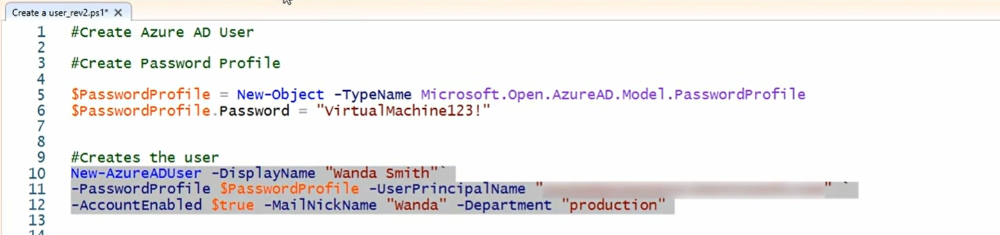
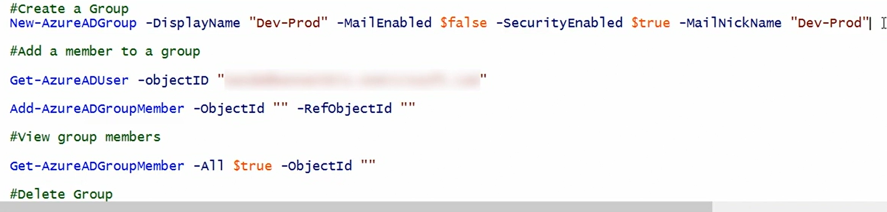
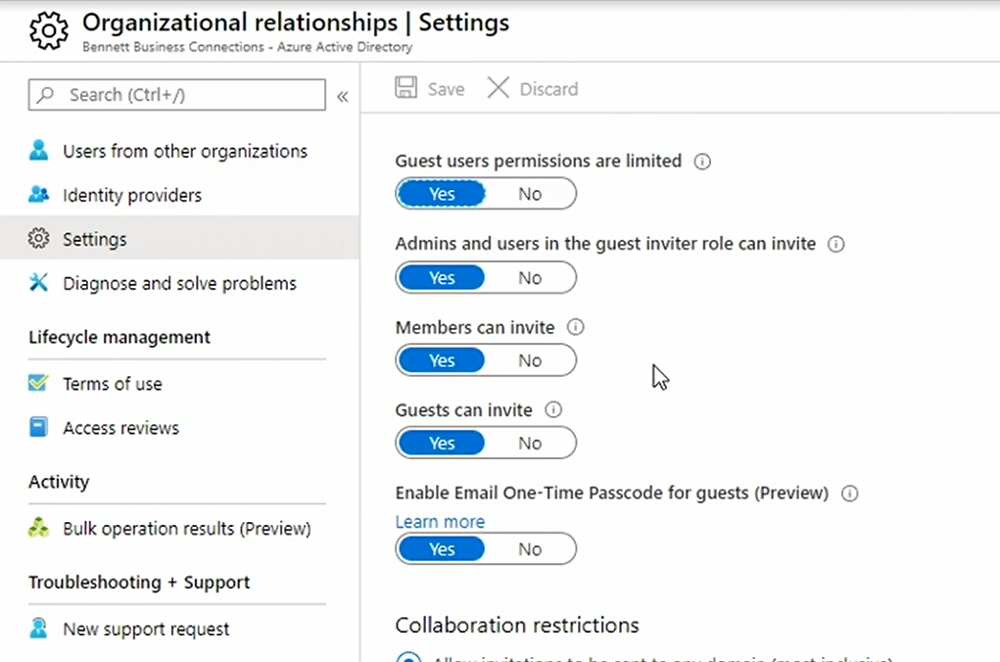

# USers and Groups: 

## Create users: 

- **using portal** : 
  - all users -> new user -> select create
  - provide username, name, password, assign group and roles, job title, department

- **using powershell**:
- **create user**:
  - 
  - above we are creating password profile first and supply password 
  - then using New-AzureADUser we will create actuial user
- **delete user**:
  - use Remove-AzureADUSer command and pass ObjectId
- **list user**:
  - get-AzureADUser

## Manage users

- assign usage location to users after its created by editing user properties
- **this is mandatory else we cannot assign any license to user without fulfilling above criteria.** 
- can assign roles etc. here

- under user settings we can check - Users can register applications, Restrict access to Azure AD administration portal and linkedin account connections 

## Create groups: 

### using portal: 
- **2 choices** : 
  - **security group** - provide access to azure resources  
   - **office 365 group**: provides access to a shared mailbox, calendar files, SharePoint, as well as other services that are available in Office 365
    - Office 365 group supports users that are outside of the organization
- **membership**:
  - **standard assigned membership**: 
    - manually add users to group
  - **dynamic membership**:
    - users or devices are automatically added and removed based on specific criteria

- if you don't add an owner, then users who are group managing admins can manage the group
- Microsoft recommends that every group has at least one owner.

### using powershell:

## Manage groups: 

- we cannot add members to dynamic groups
- dynamic groups and office 365 groups cannot be nested
- we cannot delete single existing owner from group. Add more owners to delete current one.

## Bulk upload/delete users:

- can be done via portal or powershell
- To bulk upload, pop into all users in Azure Active Directory, and then select bulk create. 
- If you do not already have a CSV template, you'll need to download it.
- you can add up to 50,000 records
- At the very least, for each user, you'll need to provide their **display name, their user principal name and the password profile.**
- You can block their sign in, provide the first name or last name, their job title, department, et cetera. Be sure to add the usage location, if you're planning on assigning licenses
- similarly, bulk delete can be done via csv and only requirement is users principal name

## Manage Guest Account:

- Azure AD -> select users -> guest user -> proivide basic details 
- usage location if you want to assign license
- user will receive email and complete sign in process
- to see all guest users: Azure AD -> Organizational relationship -> you will see list of guest users 
- settings for guest users: 
- 