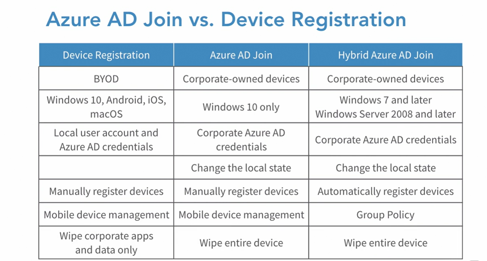

## _to be reviewed and make it simpel_

## Domain join
- lets talk about domain join first before AD join. 
- this is how **traditional devices are connected to on-prem AD**
- we login with corporate id
- authentication done by on prem AD
- management of users is via group policy of on-prem AD
- give local apps featuers such as kerberos, ldap etc. 

# Azure AD Join

- Users want to be able to work from anywhere, on any device, at any time. To allow them to do that, we can use **Azure Active Directory.**

- There are three types of **device management options.** 

  - A device can be **registered**, 
  - **join**, 
  - or in a hybrid Azure scenario, we can use a **hybrid Azure Active Directory join**.

## Device Registration
- register device to azure AD
- identity is assigned to device
- authenticate device to azure AD
- enable or disable the device
- combine with mobile device management for conditional access
- **ideal for personally owned laptops or mobile devices**

## Device Join
- extension of registering the device
- change the state of device:
  - **users sign in with org account or school account**. No personal account
  - **once device is joined then we can manage as per company policy**
- Windows 10 - Applicable
- iOS/Android/MacOS - NA
- windows server cannot be joined using azure AD
- Benefits: 
  - single sign-on
  - restrict access
  - state roaming
  - windows hello
  - microsoft store for biz access
  - - **ideal for corporate owmed laptops or mobile devices in a cloud only and cloud centric environment**

## Hybrid Azure AD

- used when devices are joined with AD on premises
- win 7 or later

## Enterprise State Roaming

- this is avaialble with Azure AD join if you have premium enabled.
- **settings and app data are sync across devices**
- applies to win 10
- time save to configure new device
- content is encrypted
- separation of corporate and consumer data
- data automatically encrypted before leaving device
- **Requirements**:
  - Azure AD premium
  - enterprise mobility + security
  - auth using azure AD identity
- **Data Retention**:
  - data retaited until manually deleted
  - data delete until state( 1 year)
  - deleted data cannot be recovered

