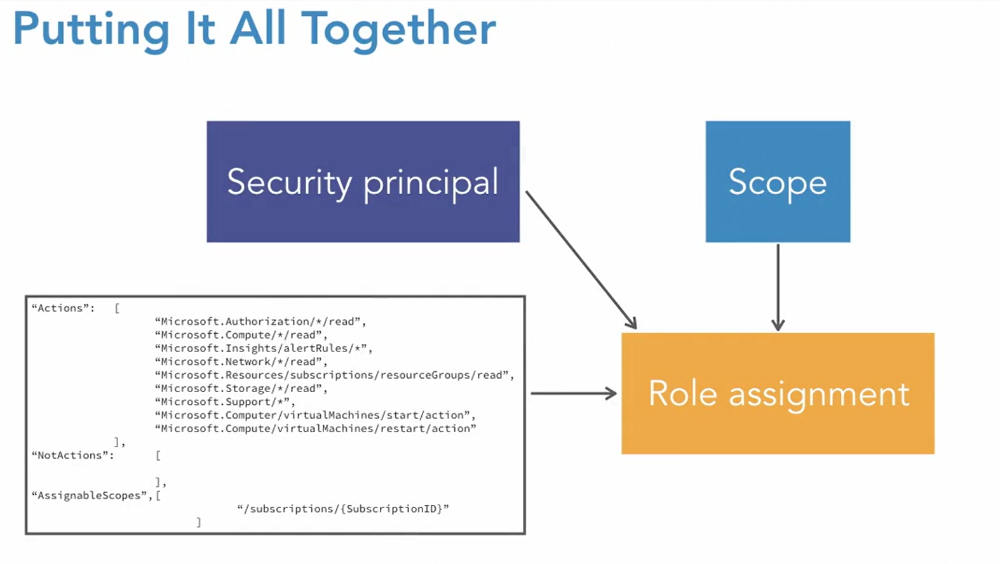

# RBAC

 
- Role-based access control rules are used to restrict access to resources in Azure.
- RBAC ensures only the right users have the right access to the right resource.
- RBAC Role Scope: 
- RBAC rules are assigned to management group down to the resource
- Not that it shares parent-child relationship so if some rule is applied to subscription then it's automatically inherited by respective resources which are part of that subscription.


## Azure Active Directory roles  vs RBAC roles

- Azure Active Directory roles are used to manage Azure Active Directory resources, which include 
  - managing users, 
  - assigning admin roles, 
  - resetting passwords, 
  - managing licenses, 
  - and managing domains

- RBAC roles provide access management to Azure resources. 
- There are several types of RBAC roles. The top three are 
  - owner, 
  - contributor, and 
  - reader
  - Special Role -> User Access Administrator
  - Several build-in roles
  - Custom Roles

## Permissions required to assign RBAC role:
```text
Microsoft.Authorization/roleAssignments/write
Microsoft.Authorization/roleAssignments/delete
```
- Only two accounts have these permissions: 
  - User Access Administrator
  - Owner


## Points to remember when assigning roles:

- work off the principle of least privilege
- Only provide permissions for that user to do what they need to do, nothing more
- A role assignment consists of three elements:
  - security principle: who or what need access
    - it can be user
    - group
    - service principal - identity used by apps to access azure resouces
    - managed identity - identity that is managed by Azure Active Directory, Typically, this would be a cloud app that needs to authenticate to Azure Active Directory.
  - role definition: 
    - collection of permission or what they can do
    - These are the actions and the not actions
  - scope: defining boundary of access
    - management group
    - subscription
    - resource group
    - resource


- To combine, we combine the security principle with the role definition and the scope to make the role assignment.
- 