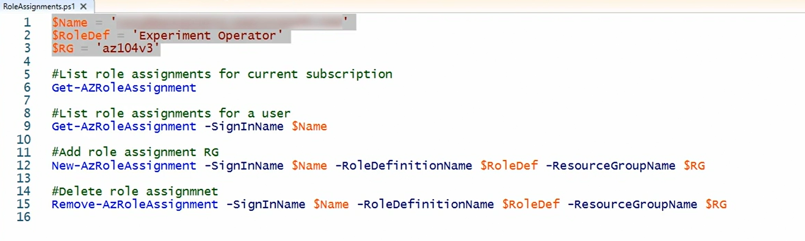

# Assign rbac role:

### using portal: 
- we can go to resource and check in Access control(IAM) to assign new roles 
- can find which user has what role
- do role assignments , deny role assignments etc. 

### using powershell: 

- Get-AZRoleAssignment, Get-AZRoleAssignment with SigninName for particular user, New-AZRoleAssignment, Remove-AZRoleAssignment etc. 

- 

## Creating Custom Role:

- First we can check what are existing role defnitions 
- Get-AZRoleDefinition | FT Name, Custom 
- easiest way to create custom role is to modify existing role
- so we get one of existing role , convert to json and save it. 
- modify json as needed
- upload new role by providing input json file
- Get-AZRoleDefinition "Virtual Machine Power" ->  **to view role**
- **Delete Role** ->  Get-AZRoleDefinition "Virtual Machine Power"  | Remove-AZRoleDefinition 

- we can add custom roles also from portal:
- 
- 