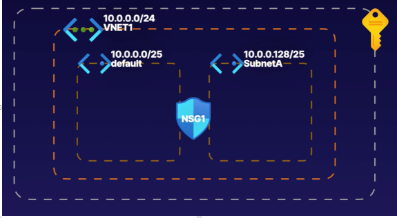

# Virtual Networking

## Virtual Network:
- Its also called VNet
- Its logical isolation of azure cloud dedicated to your subscription 
- When you create a VNet, your services and VMs within your VNet can communicate directly and securely with each other in the cloud
- A virtual network is virtual because, while you get access to it, you don't have any access to the hardware.
- Every VNet belongs to a single region. That means services and resources on a VNet must all be physically located in the same region as the VNet.
- Each VNet belongs to a single subscription. Each subscription can have more than one VNet, though.
- **Virtual networks allow for external communication to the internet, and by default, all outbound access is allowed.**
- **Inbound access to your virtual network and the resources within it requires a public IP or a public load balancer.**

**Note**: Many resources used in Azure don't need to be connected to a Virtual Network, especially if they don't natively integrate with closely with virtual machines. Think of an Azure Function which we looked at in the previous chapter. It can communicate directly onto the internet, and doesn't necessarily need to be part of a Virtual Network (although this is possible)

### Advantages of VNet:
 
- Scaling of VNet can be done on need basis
- VNets ensure HA for your resources. This is done by connecting 2 VNets through  Gateway or through a Load Balancer
- Can isolate services with VNets
- Using subnets and network security groups, you can manage and organize your resources within a VNet.
- Traffic between virtual machines in a peered network uses the private Microsoft backbone network and never passes through the public internet.

## Components of VNet

- **Address Space**
  - An address space is the range of IP addresses that are available
  - Every service or resource that is connected to a VNet will get its own unique address on that VNet within the address space.
  - You assign an address space to the VNet, and each connected device, service, or resource automatically gets an IP address assigned in that address space.

- **SubNet**
  - Subnets enable you to segment the virtual network into one or more subnetworks and allocate a portion of the virtual network's address space to each subnet. 
  - Doing that, you can have multiple networks on the same VNet
  - by default all the traffic is routed between all subnets in a virtual network. Subnets provides logical separation within VNet.
  - But why would you create subnets? it makes it easier to keep track of which services go together, address allocation is more efficient - but probably the most important reason is that you can secure individual subnets using a network security group
  - subnet IP address ranges cannot overlap
  
## Connecting 2 Vnets:

### VNet Peering: 
- VNet Peering allows us to connect virtual networks in the same or different regions and across different subscriptions. 
- Once peered, the two virtual networks appear as one for all connectivity purposes. The virtual machines in these virtual networks can communicate with each other directly by using private IP addresses.

- It provides seamless communications between those networks.

### VNet to VNet Connection: 

- Just like a peer network, we can connect VNets in different regions and subscriptions. **But this model requires a virtual network gateway, and it provides a secure tunnel for those communications between the networks.**

## Connecting VNet to On-premise Environment: 

- **Point to Site VPN** 
  - This is used to connect to a single computer, such as a client system
- **Site-to-site VPN** 
  - This is used to connect to a dedicated VPN device on premises, enabling access to the entire network
- **Azure ExpressRoute**  
  - ExpressRoute provides a direct connect between Azure and the on-premises environment using an ExpressRoute Partner
  - if you need a private, secure, high-bandwidth, low-latency connection, directly from your data center or infrastructure to Azure ,that is completely private,   ExpressRoute is the service you want

## Traffic Filtering: 

1. **Network Routes** - Route Tables and Border Gateway Protocol
2. **NSG** - Network Security Groups 

- This is how it looks like - ( VNet with subnets  and subnets connected through network Security Group)

## Load Balancer:
- It distributes incoming traffic on Load Balancer Frontend  to backend pool instances  as per rules configuration 
- A load balancer can distribute incoming requests between **virtual machines within a virtual network**, as well as incoming requests from an on-premise location network.

## VPN Gateway:

- A VPN gateway is a specific type of virtual network gateway that is used to send encrypted traffic between an Azure virtual network and an on-premises location over the public Internet.
- 3 Components of VPN Gateway:  Azure VNet, Tunnel , On Premises gateway.

## Application Gateway:

- If you recall, a load balancer receives your internet and network traffic and, based on an IP address and a port, it will send that data to one of the VMs in the backend pool.
- With Application Gateway, you can make routing decisions based on additional attributes of an HTTP request, such as URI path or host headers.
- an application gateway can scale up or down based on the traffic that comes to it.
- An application gateway has end-to-end encryption for all traffic
- can be used to load balance traffic to web applications, such as Azure App Service web apps using layer 7 of the OSI model

- Note: outside azure: **HAProxy**, the world's fastest and most widely used software load balancer, fills the role as an API gateway extremely well. In addition to routing API calls for /cart or /catalog to the proper backend services, it also handles load balancing, security, rate limiting, monitoring, and other cross-cutting concerns.

## Content Delivery network:

- A content delivery network is most often called a CDN.
- It's a distributed network of servers that can deliver web content close to users.
- CDNs store cached content on what is called edge servers in locations that are close to end users to minimize latency
- Each piece of data on edge node has expiry date usually some hours depending on how often data changes.
- A CDN will protect your backend from traffic hitting it as well. Distribution of user requests and serving of content directly from edge servers, so that less traffic is sent to the origin server.

