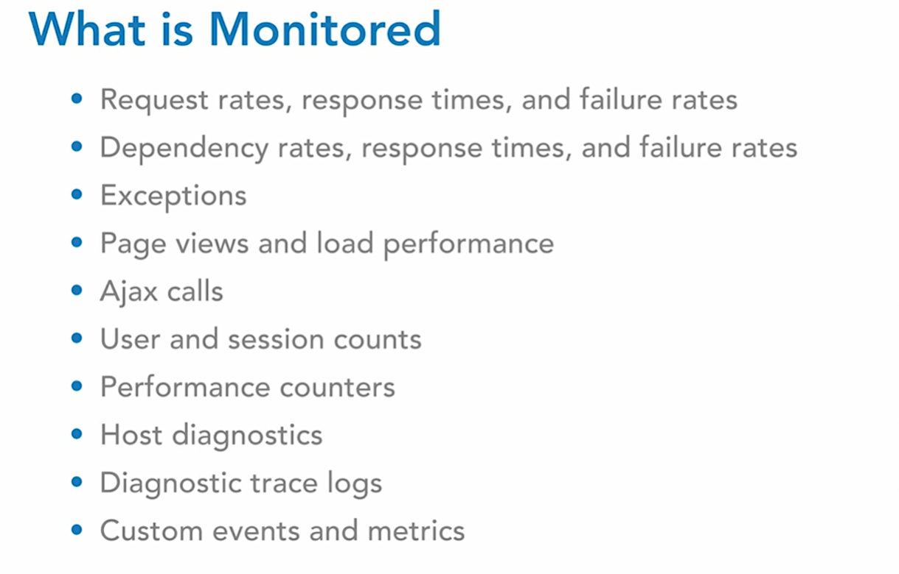
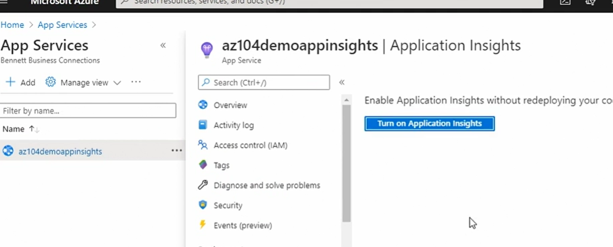
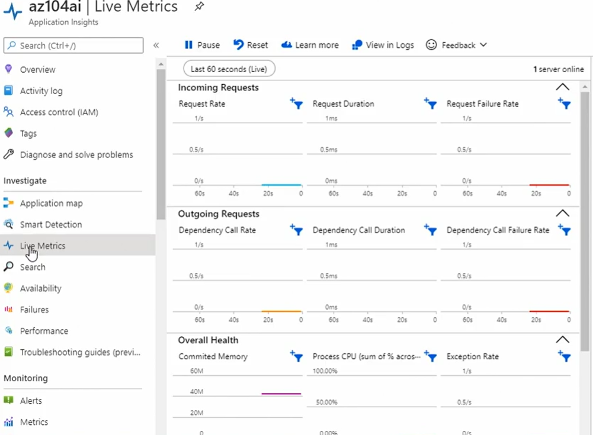

# Application Insights

- Application Insights allows you to keep an eye on your applications in real time. You can monitor live applications.
- Application Insights is supported on the following platforms. .NET, Node.JS, Java and Python.
- Application Insights will detect performance anomalies and you can use the analytics tools to diagnose issues.
- Application Insights supports on premises, hybrid, and other cloud platforms
- The telemetry data is then sent to Application Insights. That data can then be used to trigger alerts, create dashboards etc.

- 

- on web app we need to enable application insights for azure hosted apps:
- 
- so after configuring when we next go to Application insights we can check live metrics
- 
- One of the really cool things that we can do from Application Insights is we can create an application dashboard for this resource by selecting application dashboard