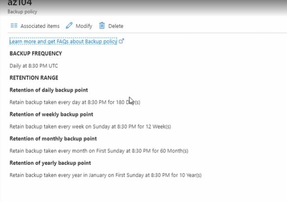
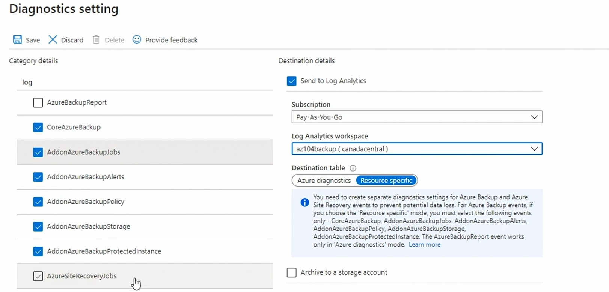

# Recovery Service Vault

- can be done on fly when creating backup 
- or can be created in advance 
- **it's a place where backup would be stored**
- Once we have created recovery service vault through portal, we can go to properties and change default storage replication type to LRS unless needed. 
- cross region restore can be enabled or disabled only for GRS.
- backup configuration cannot be changed after backup has been saved. 
- Under Security Settings we can disable Soft Delete option ( it protects data from accidental delete). Soft Delete is only applicable to Azure VM to be recovered within 14 days. 

## Creating Backup policy: 

- manage when our resources are backed up and how long data should retain
  - **HourlyLogBackup**: every hour and log retained for 30 days, its for SQL server on AzureVM. 
  - **DEfaultPolicy**- used for azure VM. 

## Policy Type:
When creating new backup policy we can select from following type: 
- Azure VM
- SAP Hana in Azure VM
- Azure File Share
- SQL Server in Azure VM

Following is example of new backup policy for Azure VM:

## Configure Backup Reporting

- create new log analytics workspace
- once its created we can configure recovery vault with log analytics workspace. 
- go to backup report -> diagnostic settins -> add new diagnostic settin -> choose log as CoreAzureBackup etc. -> choose option to send these logs to log analytics -> select log analytics workspace where we are sending these logs and -> also ensure resource specific  is enabled. 
- 
- Similarly, we can repeat this process for azure site recovery too. 

Note: 
- Recovery Service Vault should be in same region in which VMs exist. 
- Resource Group can be in differnt regions as it just contain metadata about resources but not actual resource
- 