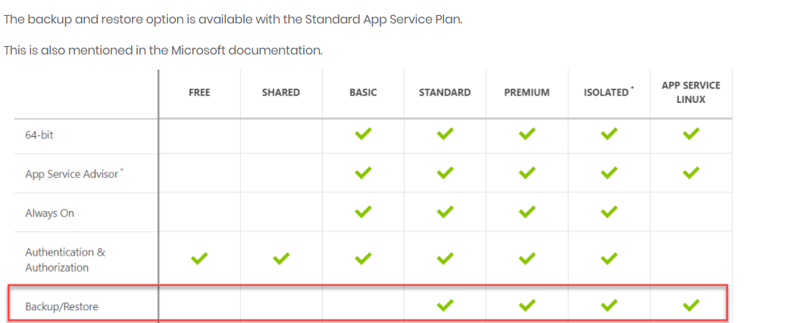
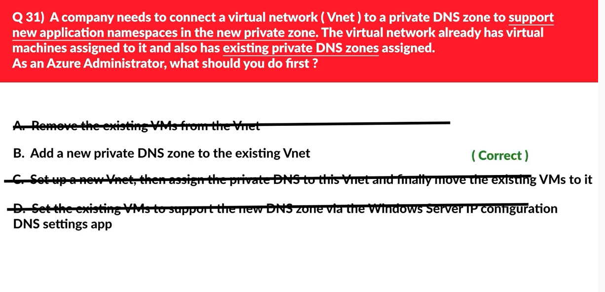

[Reference](https://www.youtube.com/playlist?list=PLyABYqulvUwZy9lvxpC5cqJVpdMwwaagp)

- deletion of resource group - ensure there are no locks active or no backup in progress . Deletion can fail if resources are connected to resources in other resource groups that are not being checked. 
- Cloud and Server Endpoints: 
    ○ Cloud endpoints are scanned every 24 hrs. so if a file is added to cloud end point then it will be only available to other endpoints after 24 hrs. 
    ○ Server Endpoint is auto synced. If a file is added to server endpoint it will be automatically available to all other endpoints.
- Adding custom domain name to  webapp - first step should be creating DNS record. 
- Identifying unused machines to shift it to lower tier: correct answer: Advisor
    ○ File Storage or any storage for underutilized vms wont help
    ○ Monitor help with monitoring performance by taking telemetry data. 
    ○ Azure Monitor doesn't support packet capture. 
    ○ Customer insights provides 360 view and bring knowledge and insights for customer
    ○ Advisor helps us to optimize and improve efficiency by identifying idle and underutilized resources. 
    ○ Azure Network Performance monitor doesn't support Packet Capture and storage
    ○ **Azure Network watcher does support packet capture and storage**

- Delegating an azure DNS subdomain 
    ○ - right way is to create an NS record for it. https://docs.microsoft.com/en-us/azure/dns/delegate-subdomain
    ○ SOA record is created automatically for top level zone only and  doesn't contain NS record for delegated subdomain  but only primary domain 
- Updating user profile info using Azure AD: 
    - **You must use Windows Server Active Directory to update the identity, contact info, or job info for users whose source of authority is Windows Server Active Directory**. After you complete your update, you must wait for the next synchronization cycle to complete before you'll see the changes.
    - For Usage Location, it can be done from anywhere.

- Supported Storage Accounts ->  Azure Import/Export service supports the following types of storage accounts:
    ○ Standard General Purpose V2
    ○ Blob Storage Account
    ○ General Purpose V1
- azcopy make : Creates a container or file share.
    ○ Example: azcopy make "https://[account-name].[blob,file,dfs].core.windows.net/[top-level-resource-name]"
    ○ For images we use blob storage.
- Creating New VM using PowerShell - New-AzVm 
- Creating New VM using CLI - az vm create
- Monitor logs and metrics of Linux VM -  use Linux diagnostic extension 4.0
    ○ HDInsight is meant for big data workloads only
    ○ Sentinel is security related service  which stops thread before they can cause harm
    ○ Azure diagnostic extension will monitor both windows and Linux. 

- Autoscaling VMs - 
- User Access Administrator role lets you manage user access to Azure resource 
- Even when resource is moved to another Resource Group, location will remain constant. Policy applied will be from target region where resource is moved. 
- Which two files company should create before preparing the drives for import job to storage account by using azure import/export service - dataset.csv and driveset.csv
- Moving from LRS on General Purpose V1 storage account to support zone failures: 
    ○ GZRS supports zone failures 
    ○ But GZRS should be on Standard General Purpose V2 account
    ○ It also supports RA-GZRS
- Moving an app to different region: 
    - Region your app runs is the region of the app service plan it should be in 
    - ASP .Net 4.7 only supports Windows 
    - .Net Core 3.0 supports both windows and Linux
- Virtual machine scale set - help with scaling VM's but doesn't provide protection against security risks
- Traffic Manager profile - it helps with Load Balance across regions
- CDN profile - it makes static web resources access faster by delivering web content close to users through their respective edge servers 
- For performance based scenario questions where App needs additional CPU etc.  First step is always scaling up pricing tier followed by enabling Autoscaling and creating a scale rule. 
- **Application Gateway provides load balancing functionality along with preventing attacks like cross-site scripting, header injection, and SQL injection etc.  And also it supports private IP load balancing**:
  - Internal Load Balancer does not provide public front end endpoint so cannot be used for internet facing app
  - Public Load balancer doesn't provide protection functionality like SQL injection etc.
  - Front Door does provide protection functionality like SQL injection etc. but requires backend pull for pull end point only.
 
- **Sending data to Log Analytics for configuring recovery service diagnostic settings and support reporting and store backup data**. 
- Secondary Region for East US is West US region
- Azure Key Vault and Access Policy helps with deploying multiple VMs with single ARM template and different adminsitrative password and which is also secured. 
- Recovery Service Vault 
- Premium file share account and access policy
- Solution for automatically removing/adding VM instances as per load requirement: 
  - **Scale Set**: correct answer 
```text
AZ - its for application failover to other zone but not for scaling in same DC
Availability Set - its deployed in same DC so it will not protect against DC failure
FAult Domain - logical grouping of underline harware sharing common powersource , configured as part of AZ
```

- cost plan which will support auto scaling and support upto 17 instances of webapp
  - shared plan will not support autoscaling as its for test 
  - basic  - doesn't support autoscaling, only support 3 instances
  - standard - it suppprts autoscaling, its limited to 10 instances 
  - **premium - its the correct answer**
	
- note backup and restore option is available with standard service plan:
  - 
- interaqctive persistent storage : azure file share
- 