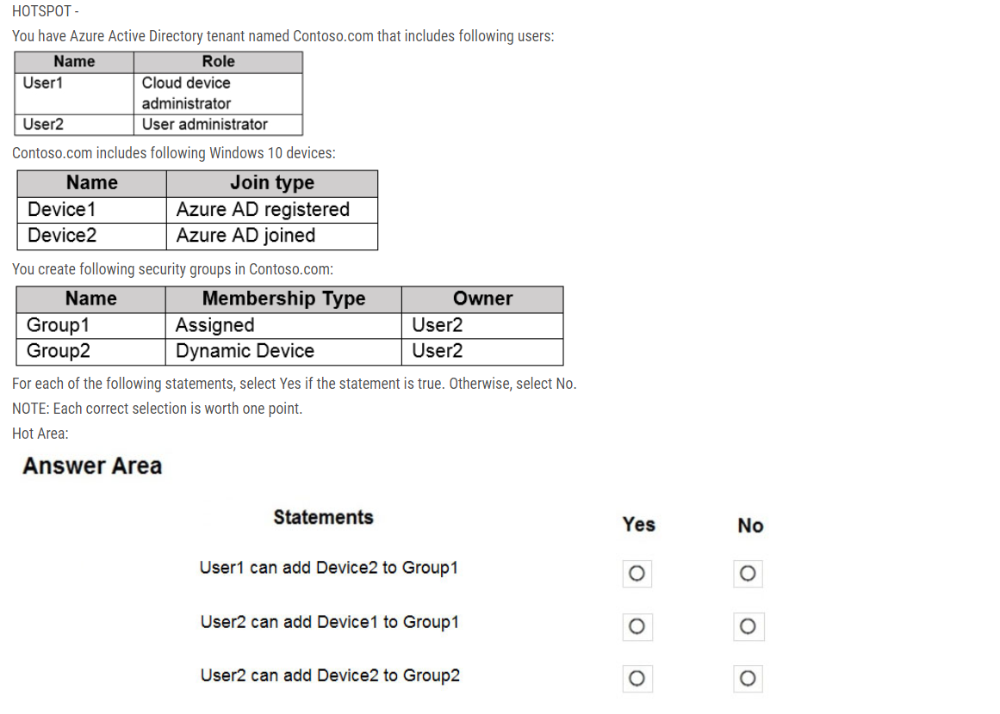

# Question Set2:

- To add the backend pool to the load balancer resource, the user needs to have permissions to be able to read the virtual network and virtual machine resources that need to be associated to the backend pool. Hence permissions need to be given at the resource group level.
  - N/W contributor on RG1 for both, see [link](https://docs.microsoft.com/en-us/azure/role-based-access-control/built-in-roles#network-contributor)
- You have an Azure subscription that contains an Azure Active Directory (Azure AD) tenant named contoso.com and an Azure Kubernetes Service (AKS) cluster named AKS1.
  An administrator reports that she is unable to grant access to AKS1 to the users in contoso.com.
  You need to ensure that access to AKS1 can be granted to the contoso.com users.
  What should you do first?
  - The Azure AD client application is used by kubectl to sign in users with OAuth 2.0 device authorization grant flow
  - [Reference](https://docs.microsoft.com/en-us/azure/aks/concepts-identity)

- You have a Microsoft 365 tenant and an Azure Active Directory (Azure AD) tenant named contoso.com.
  You plan to grant three users named User1, User2, and User3 access to a temporary Microsoft SharePoint document library named Library1.
  You need to create groups for the users. The solution must ensure that the groups are deleted automatically after 180 days.
  Which two groups should you create? Each correct answer presents a complete solution.
  - a Microsoft 365 group that uses the Assigned membership type
  - a Microsoft 365 group that uses the Dynamic User membership type
  - Only O365 groups support automatic deletion after 180 days.

- A Subscription can be assigned to 1 Management Group only at a time.
- You can move a VM and its associated resources to a different subscription by using the Azure portal.
  - VM1, storage1, VNET1, VM1Managed, and RVAULT1

- You recently created a new Azure subscription that contains a user named Admin1.
  Admin1 attempts to deploy an Azure Marketplace resource by using an Azure Resource Manager template. Admin1 deploys the template by using Azure
  PowerShell and receives the following error message: `User failed validation to purchase resources. Error message: `Legal terms have not been accepted for this item on this subscription. To accept legal terms, please go to the Azure portal (http://go.microsoft.com/fwlink/?LinkId=534873) and configure programmatic deployment for the Marketplace item or create it there for the first time.`
  You need to ensure that Admin1 can deploy the Marketplace resource successfully.
  What should you do?
```text
Set-AzMarketplaceTerms -Publisher <String> -Product <String> -Name <String> [-Accept] [-Terms <PSAgreementTerms>] [-DefaultProfile <IAzureContextContainer>] [-WhatIf] [-Confirm] [<CommonParameters>]
```

- You have an Azure Active Directory (Azure AD) tenant that contains 5,000 user accounts.
  You create a new user account named AdminUser1.
  You need to assign the User administrator administrative role to AdminUser1.
  What should you do from the user account properties?
  - Assign a role to a user -
  1. Sign in to the Azure portal with an account that's a global admin or privileged role admin for the directory.
  2. Select Azure Active Directory, select Users, and then select a specific user from the list.
  3. For the selected user, select Directory role, select Add role, and then pick the appropriate admin roles from the Directory roles list, such as Conditional access administrator.
  4. Press Select to save.

- You have an Azure Active Directory (Azure AD) tenant named contoso.onmicrosoft.com that contains 100 user accounts.
  You purchase 10 Azure AD Premium P2 licenses for the tenant.
  You need to ensure that 10 users can use all the Azure AD Premium features.
  What should you do?
  - Active Directory-> Manage Section > Choose Licenses -> All Products -> Select Azure Active Directory Premium P2 -> Then assign a user to it.
  - From the Licenses blade of Azure AD, assign a license
  - yes its true!!! apart from this we need to add location of User also
- The IT Service Management Connector (ITSMC) allows you to connect Azure and a supported IT Service Management (ITSM) product/service, such as the
  Microsoft System Center Service Manager.
  With ITSMC, you can create work items in ITSM tool, based on your Azure alerts (metric alerts, Activity Log alerts and Log Analytics alerts)

- You sign up for Azure Active Directory (Azure AD) Premium P2.
  You need to add a user named admin1@contoso.com as an administrator on all the computers that will be joined to the Azure AD domain.
  What should you configure in Azure AD?
  - Device settings from the Devices blade
```text
When you connect a Windows device with Azure AD using an Azure AD join, Azure AD adds the following security principles to the local administrators group on the device:
✑ The Azure AD global administrator role
✑ The Azure AD device administrator role
✑ The user performing the Azure AD join
In the Azure portal, you can manage the device administrator role on the Devices page. To open the Devices page:
1. Sign in to your Azure portal as a global administrator or device administrator.
2. On the left navbar, click Azure Active Directory.
3. In the Manage section, click Devices.
4. On the Devices page, click Device settings.
5. To modify the device administrator role, configure Additional local administrators on Azure AD joined devices.
Reference:https://docs.microsoft.com/en-us/azure/active-directory/devices/assign-local-admin
```

- 
  - No, Yes, No
  -Users in this role (Cloud device admin) can enable, disable, and delete devices in Azure AD and read Windows 10 BitLocker keys (if present) in the Azure portal. The role does not grant permissions to manage any other properties on the device. User1 is not a group owner so NO
  - User2 owns Group1, so they can add a device manually = YES
  -  User2 owns Group2, however this is a dynamic group and the group rules must match device2. As such, the device cannot be added manually = NO (the option does not mention User2 modifying the group rules).
```text
Owner of all groups - User2

User1 can add Device2 to Group1 - No
User2 can add Device1 to Group1 - Yes
User2 can add Device2 to Group2 - No


Owner of groups - User1 (Group1) & User2 (Group2)
User1 can add Device2 to Group1 - Yes
User2 can add Device1 to Group1 - Yes
User2 can add Device2 to Group2 - No
```

- You have an Azure Active Directory (Azure AD) tenant named contosocloud.onmicrosoft.com.
  Your company has a public DNS zone for contoso.com.
  You add contoso.com as a custom domain name to Azure AD.
  You need to ensure that Azure can verify the domain name.
  Which type of DNS record should you create?
  - MX
  - So guys i will try to give an expiation to this question.
    When you add a custom domain in azure u are not allowed to use that unless u prove its your domain.So once u add the custom domain name azure asks u to verify and you have to provide some inputs to verify that its your these inputs can be provided in TXT or MX. So its MX in this case

- DevTest Labs User role only lets you connect, start, restart, and shutdown virtual machines in your Azure DevTest Labs.
  - The Azure DevTest Labs is a role used for Azure DevTest Labs, not for Logic Apps.
  - The Logic App Contributor role lets you create, manage logic app, but not access to them. It provides access to view, edit, and update a logic app.

- You have an Azure subscription named Subscription1 that contains an Azure Log Analytics workspace named Workspace1.
  You need to view the error events from a table named Event.
  Which query should you run in Workspace1?
  - search in (Event) "error"

- VM1 and VM2 connectivity: 
  - since both VMs in same region as Vnet so they would be able to conenct to Vnet
  - even if one datacenter goes down, they will switch to other DC
  - if region goes down then all DC would be unavaialble so they won't be able to connect un less other redundancy options are set.

- You can move an app to another App Service plan, as long as the source plan and the target plan are in the same resource group and geographical region.
  The region in which your app runs is the region of the App Service plan it's in. However, you cannot change an App Service plan's region.

- You have an Azure subscription.
  Users access the resources in the subscription from either home or from customer sites. From home, users must establish a point-to-site VPN to access the Azure resources. The users on the customer sites access the Azure resources by using site-to-site VPNs.
  You have a line-of-business-app named App1 that runs on several Azure virtual machine. The virtual machines run Windows Server 2016.
  You need to ensure that the connections to App1 are spread across all the virtual machines.
  What are two possible Azure services that you can use? Each correct answer presents a complete solution.
  - an internal load balancer
  - an azure app gateway
  - Note: Network traffic from the VPN gateway is routed to the cloud application through an internal load balancer. The load balancer is located in the front-end subnet of the application.

- Advisor helps you optimize and reduce your overall Azure spend by identifying idle and underutilized resources. You can get cost recommendations from the Cost tab on the Advisor dashboard

- You have an Azure Active Directory (Azure AD) tenant.
  You need to create a conditional access policy that requires all users to use multi-factor authentication when they access the Azure portal.
  Which three settings should you configure? To answer, select the appropriate settings in the answer area.
```text
- Select Users & Groups : Where you have to choose all users.
- Select Cloud apps or actions: to specify the Azure portal
- Grant: to grant the MFA.
Those are the minimum requirements to create MFA policy. No conditions are required in the question.
```
- The User administrator role is assigned to a user named Admin1.
  An external partner has a Microsoft account that uses the user1@outlook.com sign in.
  Admin1 attempts to invite the external partner to sign in to the Azure AD tenant and receives the following error message: `Unable to invite user user1@outlook.com `" Generic authorization exception.`
  You need to ensure that Admin1 can invite the external partner to sign in to the Azure AD tenant.
  What should you do?
  - From the Users settings blade, modify the External collaboration settings. 

- You have an Azure subscription linked to an Azure Active Directory tenant. The tenant includes a user account named User1.
  You need to ensure that User1 can assign a policy to the tenant root management group.
  What should you do?
  - Assign the Owner role for the Azure subscription to User1, and then instruct User1 to configure access management for Azure resources.

- You must use Windows Server Active Directory to update the identity, contact info, or job info for users whose source of authority is Windows Server Active
  Directory.


- You need to ensure that an Azure Active Directory (Azure AD) user named Admin1 is assigned the required role to enable Traffic Analytics for an Azure subscription.
  - Your account must have any one of the following Azure roles at the subscription scope: **owner, contributor, reader, or network contributor**.
  - Note: **Traffic Manager Contributor**: Lets you manage Traffic Manager profiles, but does not let you control who has access to them.
  - 
- Azure (RBAC) and Azure AD roles are independent. AD roles do not grant access to resources and Azure roles do not grant access to Azure AD. However, a Global Administrator in AD can elevate access to all subscriptions and will be User Access Administrator in Azure root scope


- Managed identities for Azure resources provides Azure services with an automatically managed identity in Azure Active Directory. You can use this identity to authenticate to any service that supports Azure AD authentication, without having credentials in your code.
  You can enable and disable the system-assigned managed identity for VM using the Azure portal.


- You have an Azure Active Directory (Azure AD) tenant that has the contoso.onmicrosoft.com domain name.
  You have a domain name of contoso.com registered at a third-party registrar.
  You need to ensure that you can create Azure AD users that have names containing a suffix of @contoso.com.
  Which three actions should you perform in sequence? To answer, move the appropriate actions from the list of actions to the answer area and arrange them in the correct order.
  - Add a custom name, Add a record to the public contoso.com DNS zone, Verify the domain


- Yo cannot give share-level priviledges to a computer object. 
- You can lock a subscription, resource group, or resource to prevent other users in your organization from accidentally deleting or modifying critical resources.
- You apply tags to your Azure resources, resource groups, and subscriptions.
- The user principal name of each user only is sufficient for bulk delete operations 
- 
- 
- Administrative units restrict permissions in a role to any portion of your organization that you define. You could, for example, use administrative units to delegate the Helpdesk Administrator role to regional support specialists, so they can manage users only in the region that they support.