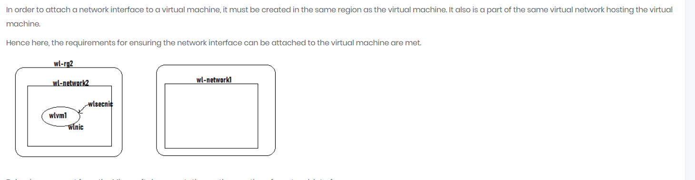
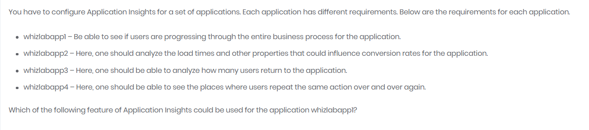

# Whizlabs Practice exam 1
[reference](https://www.whizlabs.com/learn/course/microsoft-azure-certification-az-104/298/quiz/17866/report/5784851)

- Load Balancer types:
  - Basic
    - supports upto 300 instances
    - VM in single Availability Set or VM scale set
  - Standard
    - 1000 instances
    - any VM or VM scale sets in single VNet


- (13) in order to attach N/w interface to VM, it must be created in same region and subscription
  - 

- (14) we can create resource in RG even if region for RG is diff.

- (16) recovery services vault (**RSV**) should be in same region for resources to be backed up with it.

- (17) azure blob cannot be backed up in RSV, it requires a backup vault. however, azure file share can be backed up. 
- (18) 
- (19) when we have duplicate file on file share and file server then file on file server will have its name appended with the name of the server
- (22) - when transferring large amount of data to an azure storage account, you can either use Azure Blob storage or Azure File Storage. 
```text
The Azure Storage platform includes the following data services:

Azure Blobs: A massively scalable object store for text and binary data. Also includes support for big data analytics through Data Lake Storage Gen2.

Azure Files: Managed file shares for cloud or on-premises deployments.

Azure Queues: A messaging store for reliable messaging between application components.

Azure Tables: A NoSQL store for schemaless storage of structured data.

Azure Disks: Block-level storage volumes for Azure VMs.
```

- (23) - For Admins: Security Admins, Billing admins etc, password reset policy is differnt and is not via security question. 
- (26) Azure Disk Encyption: 
  - uses bit-locker for Windows VM controlled disk
  - ADE is integrated with azure Key vault
  - uses DM-crypt for linux based VM. its not for windows
- (30):- connecting multiple networks: 
  - service endpoints are used when you want to connect network to other azure based services
  - if networks are isolated ana we need to ensure mnachine can still communicate we nedd to use virtual network peering connections.

- (31): to restore backup to another VM, you must install Microsoft Azure Recovery Service Agent on target machine. 
- (32) 
- with event subscription or notifications we cannot create alert directly. we must first record events in log analytics workspace. 
- (35) 
  - Funnels: discover how customers using your application
  - Impact: aanalyze load times and other properties
  - retention: how many users return
  - user flows: user repeat same action over and over again
- (39) to establish Point-to-Site VPN connection ensure client certificate is installed on every client computer
  - **exporting the client certificate from one and importing to another vm is also the right approach**
  - 

- (42) creating virtual network via cli
  -  
 
- (48): pay-as-you-go is not correct option for VM running 24*7*365   

- (53): we have to create service endpoint and configure network access to storage account to access it from vNet hosting VM.