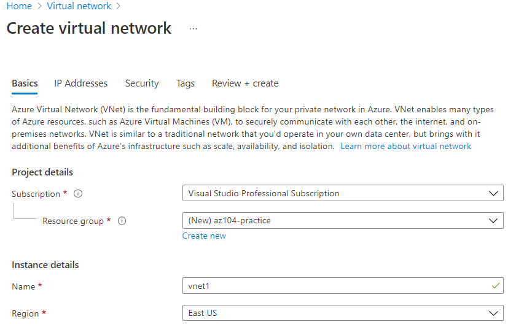
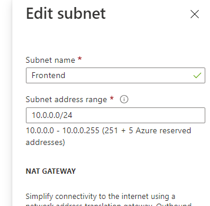

# Create VNet


- Vnet can be created individually
- Or it can be created with resource such as VM's

## Vnet using portal:

- Search vnet in marketplace
- 
- Note that when choosing IP address - For each Subnet 5 IP would be reserved by Azure 
- 
- VNet Created successfully

## Vnet using PowerShell: 

Note: connecting azure from windows powershell not working currently hence using one from portal directly: 

- Create a new resource group
```
PS /home/nitin> $RG='VNet_PS'
PS /home/nitin> $Location = 'CanadaCentral'
PS /home/nitin> $VNetName = 'VNet1'
PS /home/nitin> New-AzResourceGroup -Name $RG -Location $Location

ResourceGroupName : VNet_PS
Location          : canadacentral
ProvisioningState : Succeeded
Tags              :
ResourceId        : /subscriptions/7232b02a-48c6-4a31-9fa8-014dc71bb52c/resourceGroups/VNet_PS

```

- Create the virtual network
```text
PS /home/nitin> $virtualNetwork = New-AzVirtualNetwork `
>>   -ResourceGroupName $RG `
>>   -Location $Location `
>>   -Name $VNetName `
>>   -AddressPrefix 10.7.0.0/16
```

- Create subnet: 
```text
PS /home/nitin> Add-AzVirtualNetworkSubnetConfig `
>>   -Name FrontEnd `
>>   -AddressPrefix 10.7.0.0/24 `
>>   -VirtualNetwork $virtualNetwork


WARNING: Upcoming breaking changes in the cmdlet 'Add-AzVirtualNetworkSubnetConfig' :
Update Property Name
Cmdlet invocation changes :
    Old Way : -ResourceId
    New Way : -NatGatewayId
Update Property Name
Cmdlet invocation changes :
    Old Way : -InputObject
    New Way : -NatGateway
Note : Go to https://aka.ms/azps-changewarnings for steps to suppress this breaking change warning, and other information on breaking changes in Azure PowerShell.

Name                   : VNet1
ResourceGroupName      : VNet_PS
Location               : canadacentral
Id                     : /subscriptions/7232b02a-48c6-4a31-9fa8-014dc71bb52c/resourceGroups/VNet_PS/providers/Microsoft.Network/virtualNetworks/VNet1
Etag                   : W/"0071cd5a-05f0-405b-8ec4-13f4c506ce9f"
ResourceGuid           : c1f7972c-bff7-496c-8a4b-591d470fb814
ProvisioningState      : Succeeded
Tags                   :
AddressSpace           : {
                           "AddressPrefixes": [
                             "10.7.0.0/16"
                           ]
                         }
DhcpOptions            : {}
FlowTimeoutInMinutes   : null
Subnets                : [
                           {
                             "Name": "FrontEnd",
                             "AddressPrefix": [
                               "10.7.0.0/24"
                             ],
                             "PrivateEndpointNetworkPolicies": "Enabled",
                             "PrivateLinkServiceNetworkPolicies": "Enabled"
                           }
                         ]
VirtualNetworkPeerings : []
EnableDdosProtection   : false
DdosProtectionPlan     : null
ExtendedLocation       : null

```

- associate subnet with Vnet
```text
PS /home/nitin> $virtualNetwork | Set-AzVirtualNetwork

Name                   : VNet1
ResourceGroupName      : VNet_PS
Location               : canadacentral
Id                     : /subscriptions/7232b02a-48c6-4a31-9fa8-014dc71bb52c/resourceGroups/VNet_PS/providers/Microsoft.Network/virtualNetworks/VNet1
Etag                   : W/"c5bdbb79-4c0a-42c4-a52d-bad9ea19e263"
ResourceGuid           : c1f7972c-bff7-496c-8a4b-591d470fb814
ProvisioningState      : Succeeded
Tags                   :
AddressSpace           : {
                           "AddressPrefixes": [
                             "10.7.0.0/16"
                           ]
                         }
DhcpOptions            : {
                           "DnsServers": []
                         }
FlowTimeoutInMinutes   : null
Subnets                : [
                           {
                             "Delegations": [],
                             "Name": "FrontEnd",
                             "Etag": "W/\"c5bdbb79-4c0a-42c4-a52d-bad9ea19e263\"",
                             "Id": "/subscriptions/7232b02a-48c6-4a31-9fa8-014dc71bb52c/resourceGroups/VNet_PS/providers/Microsoft.Network/virtualNetworks/VNet1/subnets/FrontEnd",
                             "AddressPrefix": [
                               "10.7.0.0/24"
                             ],
                             "IpConfigurations": [],
                             "ServiceAssociationLinks": [],
                             "ResourceNavigationLinks": [],
                             "ServiceEndpoints": [],
                             "ServiceEndpointPolicies": [],
                             "PrivateEndpoints": [],
                             "ProvisioningState": "Succeeded",
                             "PrivateEndpointNetworkPolicies": "Enabled",
                             "PrivateLinkServiceNetworkPolicies": "Enabled",
                             "IpAllocations": []
                           }
                         ]
VirtualNetworkPeerings : []
EnableDdosProtection   : false
DdosProtectionPlan     : null
ExtendedLocation       : null
```

- **View Details:** 

```text
PS /home/nitin> Get-AzVirtualNetwork -Name $VNetName -ResourceGroupName $RG

Name                   : VNet1
ResourceGroupName      : VNet_PS
Location               : canadacentral
Id                     : /subscriptions/7232b02a-48c6-4a31-9fa8-014dc71bb52c/resourceGroups/VNet_PS/providers/Microsoft.Network/virtualNetworks/VNet1
Etag                   : W/"c5bdbb79-4c0a-42c4-a52d-bad9ea19e263"
ResourceGuid           : c1f7972c-bff7-496c-8a4b-591d470fb814
ProvisioningState      : Succeeded
Tags                   :
AddressSpace           : {
                           "AddressPrefixes": [
                             "10.7.0.0/16"
                           ]
                         }
DhcpOptions            : {
                           "DnsServers": []
                         }
FlowTimeoutInMinutes   : null
Subnets                : [
                           {
                             "Delegations": [],
                             "Name": "FrontEnd",
                             "Etag": "W/\"c5bdbb79-4c0a-42c4-a52d-bad9ea19e263\"",
                             "Id": "/subscriptions/7232b02a-48c6-4a31-9fa8-014dc71bb52c/resourceGroups/VNet_PS/providers/Microsoft.Network/virtualNetworks/VNet1/subnets/FrontEnd",
                             "AddressPrefix": [
                               "10.7.0.0/24"
                             ],
                             "IpConfigurations": [],
                             "ServiceAssociationLinks": [],
                             "ResourceNavigationLinks": [],
                             "ServiceEndpoints": [],
                             "ServiceEndpointPolicies": [],
                             "PrivateEndpoints": [],
                             "ProvisioningState": "Succeeded",
                             "PrivateEndpointNetworkPolicies": "Enabled",
                             "PrivateLinkServiceNetworkPolicies": "Enabled",
                             "IpAllocations": []
                           }
                         ]
VirtualNetworkPeerings : []
EnableDdosProtection   : false
DdosProtectionPlan     : null
ExtendedLocation       : null
```

