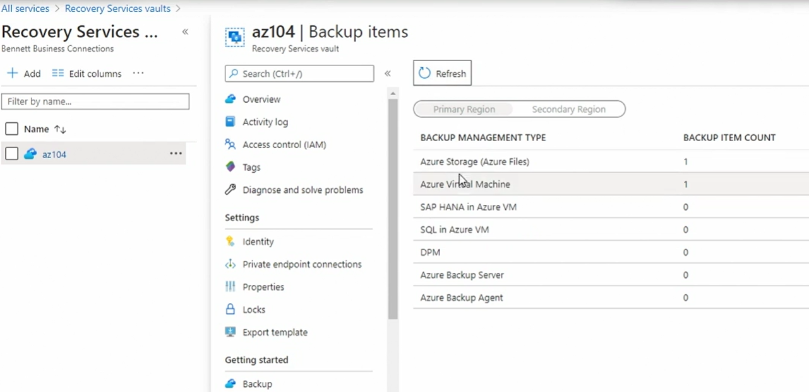

# Azure Backup Service

- once we have azure recovery service vault created we can go for azure backup service creation 
- we can do on premise backup or backup of one of azure resources 
- if we dont see our options to choose our resource to be backed up it means resource is already backed up or its in diff region than recovery services vault.
- similarly for file share backup we need to select appropriate policy and storage account when creating new backup. 
- once done we can verify existing backup reporting as follows: 
- 

# Azure Site Recovery: 

- here we are protecting our systems on primary site
- data transfer is secure
    - we can protect on premises linux and windows physical machines to azure
    - hyper-v machines to azure or recovery site
    - vmware machine to azure or recovery site
    - aws to azure
    - azure rgion to azure region 

- can configure customizable recovery plans 
  - web servers or db servers to fail together
- perform actions 
  - add script
  - manual action
- add azure runbook

- Failover testing: 
  - validate failover
  - doesnot disrupt prod
  - test failover before crises
- failback: 
  - failback to vmware, hyper-v or alernate location

## Configure Azure Site Recovery: 

- we can do same under Disaster Recovery Option 
- new target resource group and new target network would be created
- it will take some time for new site recovery resources to be created
-  
## Perform site-to-site recovery: 

- go to recovery service vault -> protected items -> test failover
- after test failover is success you need to clean it up so that extra resources created in asr resource group are deleted. 
- if we no need to protect this VM we can simply disable replication 
- 