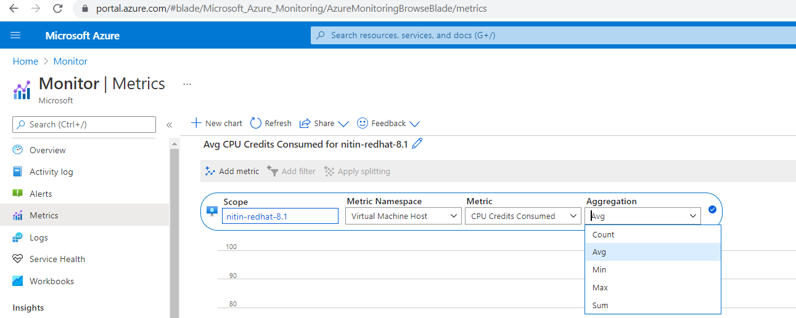
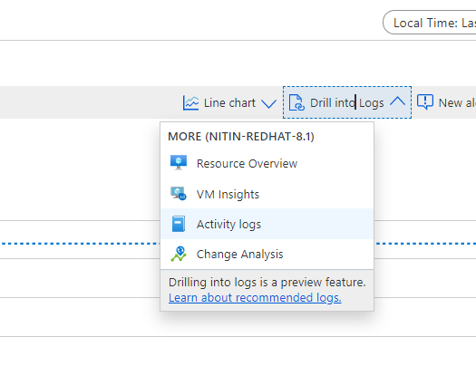
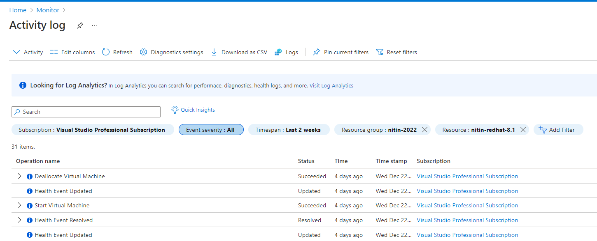

# configure metrics:

- A key role of an Azure administrator is to monitor the metrics of a resource, and that can be easily done using Azure Monitor.
- can select metrics as follows: 

- we cannot select multiple resources when defining metrics scope.
- filter can be added to select  individual vms in case we have selected scope as virtual machine scale set. 
- it will then display individual lines per machines 
- You can also change the type of chart. It can be a line or an area, bar, scatter, or grid
- we can drill into activity logs 

- and also export as csv, can check start, stop, deallocated times etc. 
 

- we can also create alerts based on condition
- 
