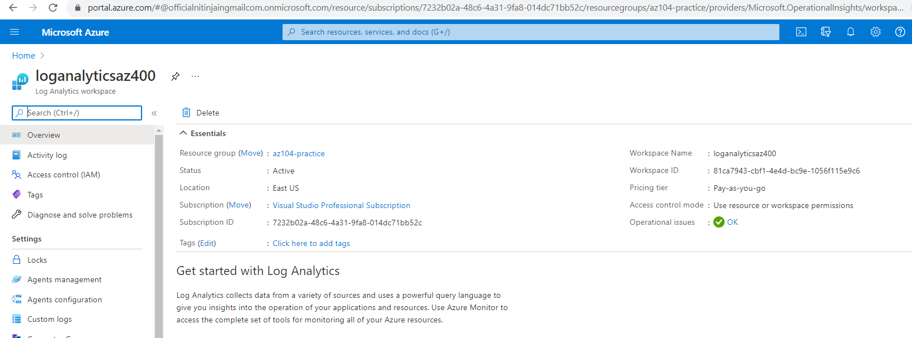
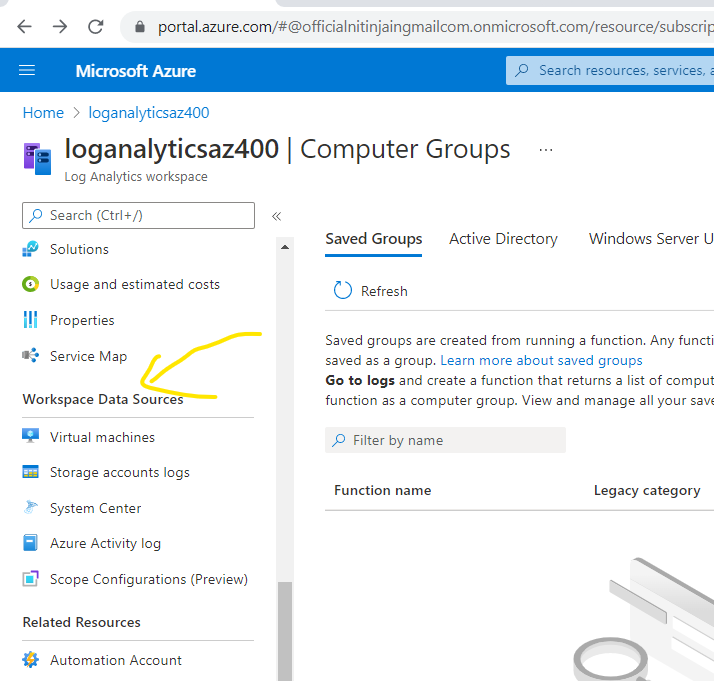
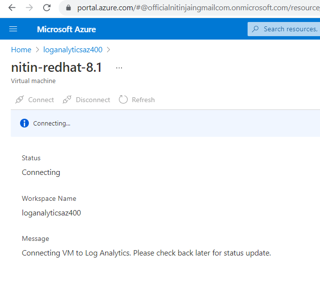
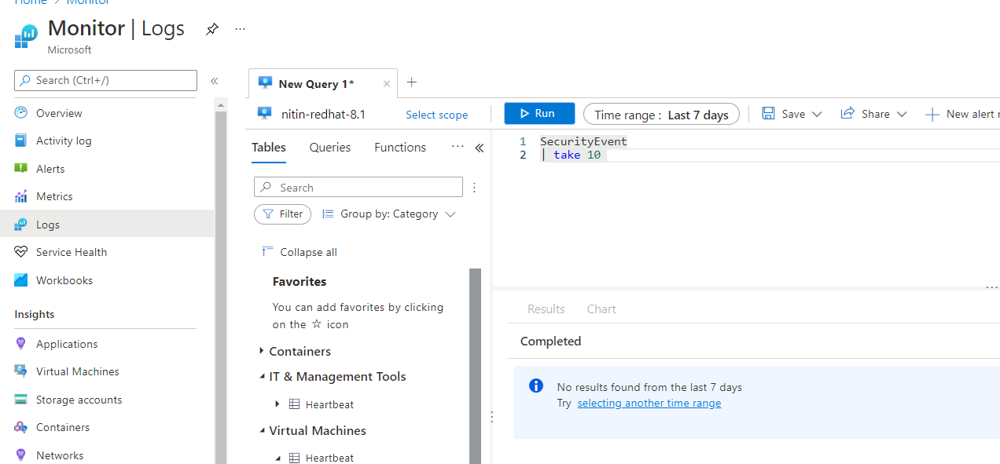
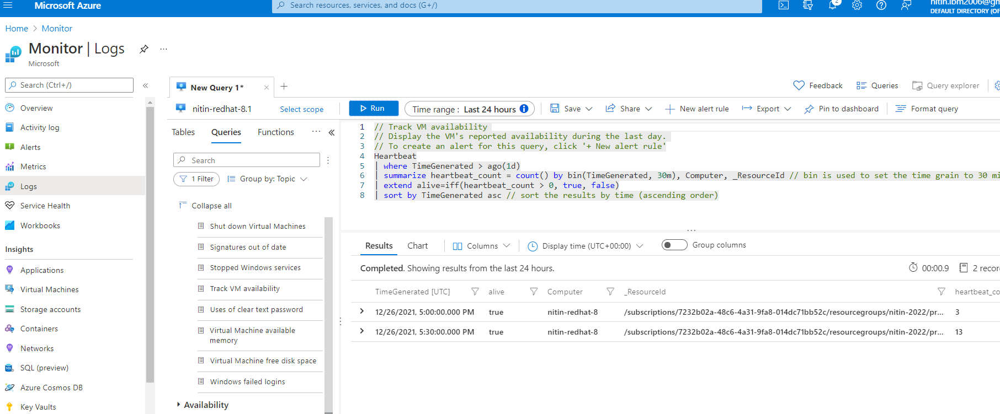
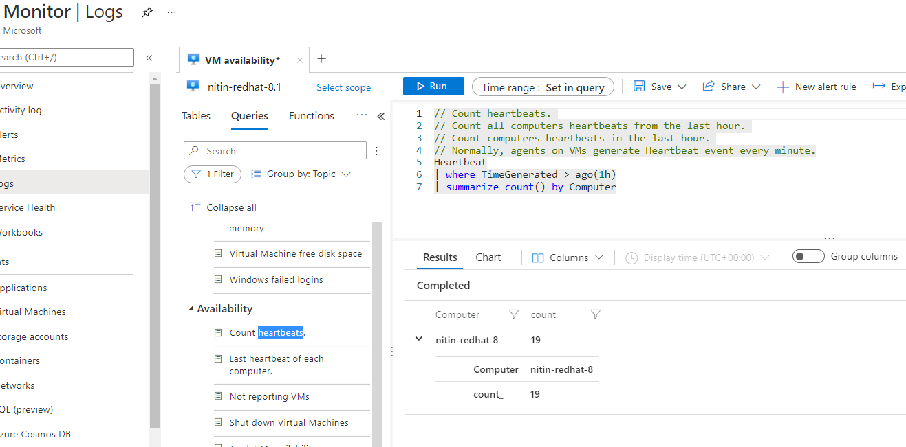

# Configure log analytics

- log analytics allows you to explore your resources in depth
- search for log analytics in azure portal and create log analytics workspace
- 
- Our next step to configuring this workspace is to connect our data sources.
- 
- select VM and connect to it, note that VM must be running
- You can pull logs from virtual machines, storage accounts, the Azure activity logs, and scope configurations, which is currently in preview.
- 
- under agent configuration  we can add various performance counter - windows and linux


# Query and Analyze logs: 

- go to Monitor -> logs -> add our VM -> and run your query

To display 10 records from the SecurityEvent table, for example, use the following command:
```text
SecurityEvent
| take 10
```


- another query to track VM availability:
```text
// Track VM availability 
// Display the VM's reported availability during the last day. 
// To create an alert for this query, click '+ New alert rule'
Heartbeat
| where TimeGenerated > ago(1d)
| summarize heartbeat_count = count() by bin(TimeGenerated, 30m), Computer, _ResourceId // bin is used to set the time grain to 30 minutes
| extend alive=iff(heartbeat_count > 0, true, false)
| sort by TimeGenerated asc // sort the results by time (ascending order)
```


- counting heartbeat: 


