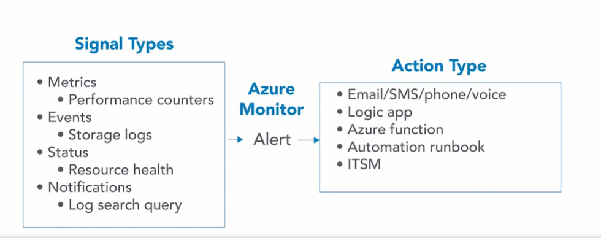
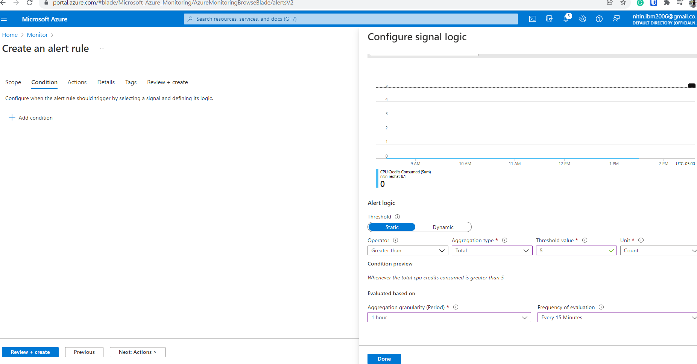

# Azure Alerts

- Azure Alerts can be created to let you or others know that something is amiss within your Azure infrastructure.
- Azure Alerts can be triggered from several signal types, 
  - including metrics - such as performance counters, 
  - events - storage logs, 
  - the status - resource health, 
  - notifications - log search queries
- The signal types would then trigger an alert within Azure Monitor.
- The alert is then sent to an action group.
- In the action group has a list of receivers 
  - sending an email 
  - or SMS, phone,
  - or voice, 
  - Logic app
  - or an Azure function.
  - ITSM
  - webhook
  
- 

- **Azure Alert components**:
  - target: resource to monitor
  - criteria: condition that will trigger the action
  - action: action that will be sent to receiver

- Alert frequency can be limited by **rate limiting function**
- create alert and define signal logoc here:
- 
- 